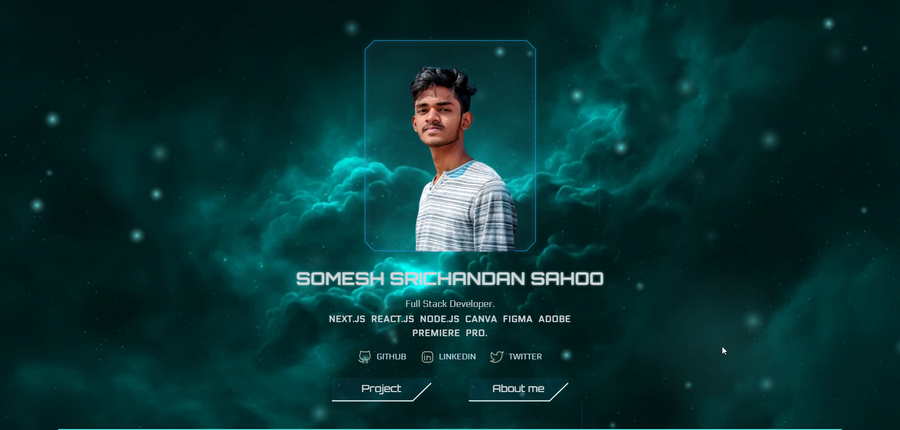
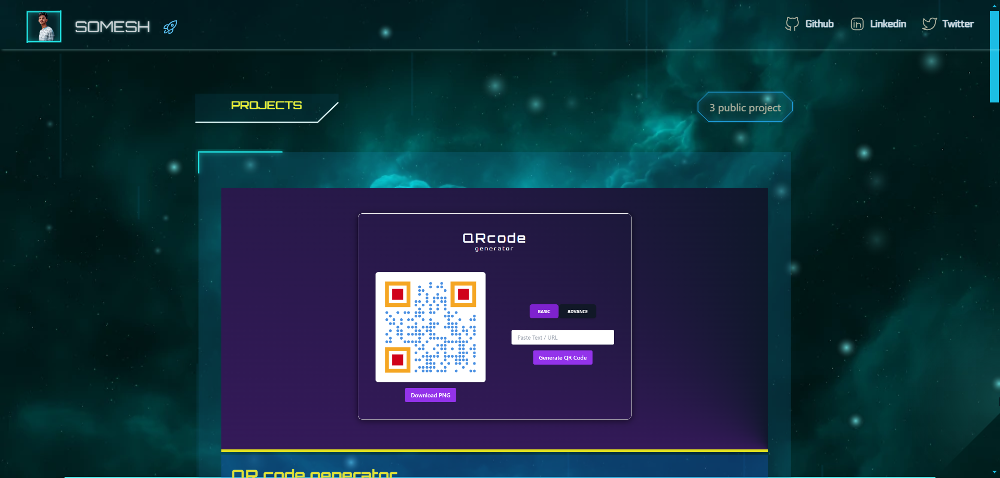
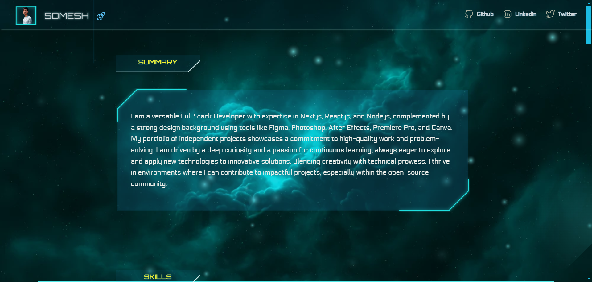

# My Personal Portfolio



Welcome to my personal portfolio! This project is designed with a futuristic, sci-fi aesthetic using Arwes JS. Explore my work, skills, and projects in a visually stunning environment inspired by space and technology.

## Tech Stack

 **Frontend**: React.js, Arwes JS, Tailwind CSS
 **Styling**: Custom CSS with sci-fi elements

## Features

 **Interactive Design**: Engage with a sci-fi themed user interface using Arwes JS.
 **Responsive Layout**: Designed to look great on both desktop and mobile devices.
**Dynamic Animations**: Futuristic animations and effects to enhance user experience.

## Installation

To run this project locally, follow these steps:

1. **Clone the repository**:
   ```bash
   git clone https://github.com/someshsrichandan/someshsrichandan.github.io
   cd someshsrichandan.github.io
   ```

2. **Install dependencies**:
   ```bash
   npm install
   ```

3. **Run the development server**:
   ```bash
   npm run dev
   ```

4. Open your browser and navigate to `http://localhost:3000` to view the portfolio.

## Usage

Feel free to explore the portfolio to see my projects and skills. The design is inspired by the sci-fi world with a focus on creating an immersive experience.

## Acknowledgments

- **Arwes JS**: A futuristic sci-fi design system for web applications. Check out Arwes JS [here](https://arwes.dev/).
- **React.js**: A JavaScript library for building user interfaces.
- **Tailwind CSS**: A utility-first CSS framework for rapid UI development.

## Screenshot





> *Note: Replace the image placeholders with actual screenshots of your portfolio.*

## Contact

If you have any questions or would like to connect, feel free to reach out:

- **Email**: contact.someshsrichandan@gmail.com
- **LinkedIn**: [Your LinkedIn](https://linkedin.com/in/someshsrichandan)

---

Made with 💙 using [Arwes JS](https://arwes.dev/)
```
